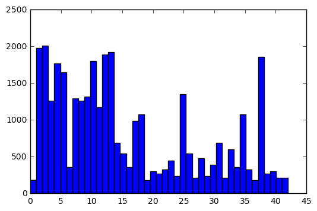
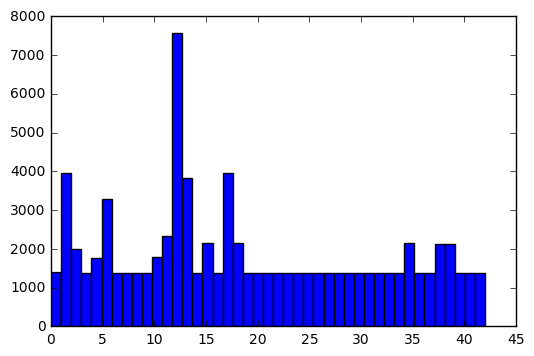
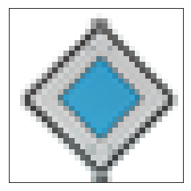
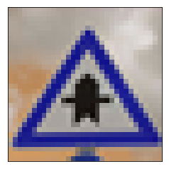
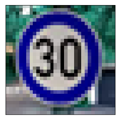

# Traffic Sign Classifier 
### Udacity Project


## German Traffic Sign set

### Dataset Summary

The Dataset provided was from German Traffic Sign Dataset which has approx. of 60,000 images. The Images were further made into Training images, validation images and test images. The images were further classified into 43 classes.

### Dataset Visualization


```python

```

    Number of training examples = 34799
    Number of testing examples = 12630
    Image data shape = (32, 32, 3)
    Number of classes = 43


    (array([  180.,  1980.,  2010.,  1260.,  1770.,  1650.,   360.,  1290.,
             1260.,  1320.,  1800.,  1170.,  1890.,  1920.,   690.,   540.,
              360.,   990.,  1080.,   180.,   300.,   270.,   330.,   450.,
              240.,  1350.,   540.,   210.,   480.,   240.,   390.,   690.,
              210.,   599.,   360.,  1080.,   330.,   180.,  1860.,   270.,
              300.,   210.,   210.]),
     array([  0.        ,   0.97674419,   1.95348837,   2.93023256,
              3.90697674,   4.88372093,   5.86046512,   6.8372093 ,
              7.81395349,   8.79069767,   9.76744186,  10.74418605,
             11.72093023,  12.69767442,  13.6744186 ,  14.65116279,
             15.62790698,  16.60465116,  17.58139535,  18.55813953,
             19.53488372,  20.51162791,  21.48837209,  22.46511628,
             23.44186047,  24.41860465,  25.39534884,  26.37209302,
             27.34883721,  28.3255814 ,  29.30232558,  30.27906977,
             31.25581395,  32.23255814,  33.20930233,  34.18604651,
             35.1627907 ,  36.13953488,  37.11627907,  38.09302326,
             39.06976744,  40.04651163,  41.02325581,  42.        ]),
     <a list of 43 Patch objects>)





### Preprocessing 

The various preprocesses were taken in account and finally flippinf of images and standardization of data set were chosen together to provide a large imageset of about 82,000 images than the current 39,000 images. I tried to standardize the expourse for all the images which led to a drop of a percent or two in both validation and test accuracy. Therefore, that satergy was dropped and images were directly converted into grayscale. Once again i tried converting the images value to ranges (0.1-0.9) and (-1 to 1) and found my model works better for the (0.1- 0.9) range, hence tgat range was selected for this project.


```python

```

    The updated number of training examples = 81590





### Model Architecture

I choose the LeNet model for this project. I have also taken the liberty to change few aspects of it to work better for this dataset. The Model consists of 2 Convolutional Layers and 3 fully connected layers. I have included two drop-out in between the fully connected layers to prevent overfitting of the model. I have sticked with ReLU activation as i found it work better than a tanh activation. Also, I have used Avg. pooling instead of a MAX pooling to make my model more efficient.


| Layer |  Description|
|--|--|
| input | 32 x 32 x 1 |
|Colvolution 1 | 1 x 1 stride valid padding output: 28 x 28 x 6 |
|ReLU | Activation |
|Avg Pooling | 2 x 2 stride valid padding output: 14 x 14 x 6 |
|Colvolution 2 | 1 x 1 stride valid padding output: 10 x 10 x 16 |
|ReLU | Activation |
|Avg Pooling | 2 x 2 stride valid padding output: 5x 5x 16 |
| Fully connected | truncated normal output: 120 |
| ReLu | Activation|
|dropout | yes |
 Fully connected | truncated normal output: 84 |
| ReLu | Activation|
|dropout | yes |
 Fully connected | truncated normal output: 43 |
| logits |	output|


### Model Training

The optimizer used is Adam's Optimizer. The batch size was choosen as 150 as I wanted to keep the size in the middle rather than a something small like 64 as it will take a long time to train or large like 512 which will lead to taking small number of images for each iteration. I have kept the drop rate at 0.7 instead of standard 0.5 as i found 0.7 working faster for my imageset than a 0.5. I also wanted to keep EPOCH as minimum as possible. I found that after 20 EPOCHS the Model wasn't really learning much so i stopped it at 20 EPOCH. I have used a mean of zero and a standard deviation of 0.1 for the CNN.

### Solution Approach

The Valdiation accuray for my final run was 96% and a test accuracy of 94%. The fianl value were varying by 0.01 to 0.005 for mutliple runs.

Training...
EPOCH 1 ...
Validation Accuracy = 0.838

EPOCH 2 ...
Validation Accuracy = 0.893

EPOCH 3 ...
Validation Accuracy = 0.916

EPOCH 4 ...
Validation Accuracy = 0.921

EPOCH 5 ...
Validation Accuracy = 0.932

EPOCH 6 ...
Validation Accuracy = 0.934

EPOCH 7 ...
Validation Accuracy = 0.929

EPOCH 8 ...
Validation Accuracy = 0.950

EPOCH 9 ...
Validation Accuracy = 0.941

EPOCH 10 ...
Validation Accuracy = 0.951

EPOCH 11 ...
Validation Accuracy = 0.950

EPOCH 12 ...
Validation Accuracy = 0.956

EPOCH 13 ...
Validation Accuracy = 0.954

EPOCH 14 ...
Validation Accuracy = 0.946

EPOCH 15 ...
Validation Accuracy = 0.953

EPOCH 16 ...
Validation Accuracy = 0.962

EPOCH 17 ...
Validation Accuracy = 0.954

EPOCH 18 ...
Validation Accuracy = 0.959

EPOCH 19 ...
Validation Accuracy = 0.962

#####  EPOCH 20 ...
##### Validation Accuracy = 0.961

Model saved

##### Test Accuracy = 0.935

## Test Images

### Acquiring New Images
5 new images were taken from the internet and were changed to the desired dimension of 32*32*3 as all the images taken were of RGB type images. I have take simple straightforward images so i expect the model to predict all of the or atlest 3 of them


```python
import matplotlib.image as mpimg
import cv2
import matplotlib.pyplot as plt
img = cv2.imread("test_images/2.png")
plt.imshow(img, cmap = 'gray')
plt.xticks([]), plt.yticks([])  # to hide tick values on X and Y axis
plt.show()
img = cv2.imread("test_images/3.png")
plt.imshow(img, cmap = 'gray')
plt.xticks([]), plt.yticks([])  # to hide tick values on X and Y axis
plt.show()
img = cv2.imread("test_images/4.png")
plt.imshow(img, cmap = 'gray')
plt.xticks([]), plt.yticks([])  # to hide tick values on X and Y axis
plt.show()
img = cv2.imread("test_images/1.png")
plt.imshow(img, cmap = 'gray')
plt.xticks([]), plt.yticks([])  # to hide tick values on X and Y axis
plt.show()
img = cv2.imread("test_images/5.png")
plt.imshow(img, cmap = 'gray')
plt.xticks([]), plt.yticks([])  # to hide tick values on X and Y axis
plt.show()
```











### Performance on New Images

The model did fairly well on the new images and had a accuray percent of 100% though it sometime dropped to 80%. This drop is mainly due to prediction of Road work as Bumpy road ahead.

#### Test Accuracy = 1.000

The images and the Prediction are as follows

| Image | Prediction|
|--|--|
|road work ahead | road work ahead |
|Priority road | Priority road |
|right of way  | right of way|
|speed limit 30 km/h| speed limit 30 km/h |
|Left right ahead| Left right ahead|

### Model Certainty - Softmax Probabilities

Image 0 Probabilities [ 0.3467007   0.3384043   0.21378785  0.0500998   0.03566618] 
 and clasess  [25 22 24 29 31]
Image 1 Probabilities [  1.00000000e+00   5.57035367e-19   2.44085757e-22   8.24442476e-26
   5.60764425e-26] 
 and clasess  [12 40 15  1 11]
Image 2 Probabilities [  9.99999881e-01   1.60143600e-07   5.94177593e-13   3.45092580e-13
   3.24589802e-13] 
 and clasess  [11 30 18 27 21]
Image 3 Probabilities [  9.99996662e-01   2.51505799e-06   7.88111265e-07   6.72330681e-13
   4.53978597e-13] 
 and clasess  [ 1  2  5  4 15]
Image 4 Probabilities [  9.99999881e-01   1.55201846e-07   1.61732336e-10   2.80366252e-13
   1.72632132e-13] 
 and clasess  [34 35 38 15  1]


```python
The probability of each prediction are

| Image | Prediction|
|--|--|
|road work ahead | road work ahead |
|Priority road | Priority road |
|right of way  | right of way|
|speed limit 30 km/h| speed limit 30 km/h |
|Left right ahead| Left right ahead|
```
